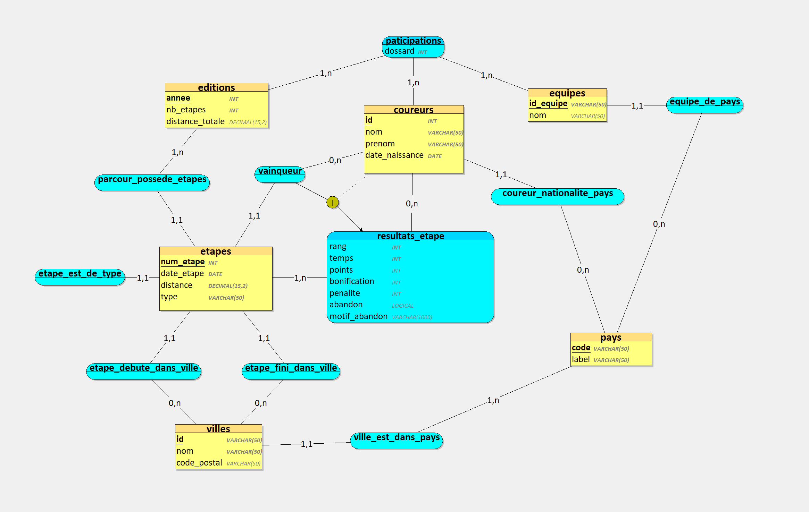

# Projet Transversal TDF

Conception et implémentation d’une base de données permettant la gestion des données du TOUR DE FRANCE

Par **Redwan BERKI**, **Florian OGUETON** et **Danaël LEGRAND**

## Phase I : Conception de la base de données

*Appliquer les étapes de conception d’une BDD pour élaborer le `MCD` et `MLD` de la BDD permettant de modéliser les données du Tour de France 2022 : les coureurs, les équipes, les étapes. Cette base de données permettra la gestion du tour de France pour une année donnée : saisie, modification des données via des formulaires, calcul de plusieurs indicateurs par coureur, par équipe, par étape.*

L’analyse de l’existant peut être faite sur : .
- https://www.letour.fr/fr/  
- [Tour de France 2022 : découvrez le parcours et les 21 étapes](https://www.rtl.fr/sport/autres-sports/tour-de-france-2022-decouvrez-leparcours-et-les-21-etapes-7900167861 )
- [Tour de France 2022 : les équipes et les coureurs en lice cette année](https://www.francebleu.fr/sports/cyclisme/tour-de-france-2022-les-equipes-etles-coureurs-en-lice-cette-annee-1655906335  )
- [Les vainqueurs d'étapes du Tour de France 2022](https://www.letour.fr/fr/vainqueur-etape-tdf-2022)

Utiliser un logiciel de conception *(par exemple : Looping)*

### 1. Faire l’inventaire des données et des règles pour la gestion du Tour de France de l’année 2022

- Données :
- Parcours :
  - Année
  - Nombre d’étapes
  - Distance totale
  - Itinéraire
- Etapes :
  - Détail des étapes :
  - Date
  - Numéro
  - Lieu départ
  - Lieu arrivé
  - Distance
  - Type
- Classement de l’étape
  - Temps individuels
  - Écarts
  - Points
  - Bonification
  - Pénalités
  - Classement général
  - Temps individuels
  - Écarts
  - Bonification
  - Pénalités
- Participants
- Equipes
- Coureurs
  - Nom
  - Prénom
  - Age
  - Pays
  - Dossard
- Abandons
  - Etape
  - Raison

Règles
Attribution des maillots : Le gagnant de l’étape antérieure, récupère le maillot jaune. Le coureur nommé le plus combatif sur l’étape antérieure récupère le maillot rouge.
Délais et pénalités
Bonification

### 2. Recenser les dépendances fonctionnelles

#### a. Identifier les différentes entités et leurs propriétés pour cette gestion

- editions (année, nb_etapes, distance_totale)
                 pays (code, label)
 types_etape (type)
  villes (code, nom, code_1)
 coureurs (id, nom, prenom, date_naissance, code)
  equipes (id_equipe, nom, code)
   etapes (num_etape, date_etape, distance, id, code, code_1, type, annee)
 coureurs_participent_etapes (num_etape, id, classement_etape, temps, points, bonification, penalite, abandon, motif_abandon)
 participations (annee, id, id_equipe, dossard)

#### b. Préciser les différentes associations entre les entités

Une édition (année) peut contenir plusieurs étapes, mais une étape appartient à une seule édition. (1,N) → (année → étapes)

Une étape (num_etape, année) est associée à une ville de départ et une ville d’arrivée. (1,1) → (code_1 dans villes)

Un coureur (id) peut participer à plusieurs étapes, et une étape peut avoir plusieurs coureurs. (N,N) → (coureurs_participent_etapes)

Un coureur (id) appartient à une seule équipe (id_equipe) par édition. (1,1) → (participations)

Une équipe (id_equipe) peut avoir plusieurs coureurs, mais un coureur appartient à une seule équipe par édition. (1,N) → (participations)

Une étape (num_etape, année) est d’un certain type (1,1) → (types_etape)

Un coureur (id) appartient à un pays (code) (1,1) → (pays)

Une ville (code) appartient à un pays (code_1) (1,1) → (pays)

Une équipe (id_equipe) appartient à un pays (code) (1,1) → (pays)

### 3. Élaborer le MCD

#### a. Préciser les cardinalités pour les différentes associations


#### b. Vérifier le modèle obtenu en appliquant les différentes règles de validation

Respect des dépendances fonctionnelles :

- Un coureur est identifié par id et dépend d’un pays via code.

- Une étape est identifiée par num_etape et année.

- Une équipe est identifiée par id_equipe et dépend d’un pays via code.

Respect des cardinalités :

- Un coureur ne peut être dans qu'une seule équipe par édition (participations).

- Une étape est toujours associée à une édition (annee).
PHASE II : Création et importation des données du Tour de France 2022
Lister l’ensemble des requêtes permettant de créer les tables avec les relations (le logiciel de conception (par exemple Looping) les génère automatiquement mais en SQL) des petites corrections de type doivent être faites pour les lancer sur SQLSERVER

## Phase II : Création et importation des données du Tour de France 2022

Lister l’ensemble des requêtes permettant de créer les tables avec les relations *(le logiciel de 
conception (par exemple Looping) les génère automatiquement mais en SQL)*

```sql
create table public.coureurs (
  id uuid not null default gen_random_uuid (),
  nom character varying not null,
  prenom character varying not null,
  date_naissance date not null,
  nationalite character varying null,
  created_at timestamp with time zone not null default now(),
  constraint coureurs_pkey primary key (id),
  constraint coureurs_nationalite_fkey foreign KEY (nationalite) references pays (code) on update CASCADE on delete set null
) TABLESPACE pg_default;
```

```sql
create table public.editions (
  annee smallint generated by default as identity not null,
  nb_etapes smallint not null default '0'::smallint,
  distance_totale real not null default '0'::real,
  constraint editions_pkey primary key (annee),
  constraint editions_annee_key unique (annee)
) TABLESPACE pg_default;
```

```sql
create table public.equipes (
  code character varying not null,
  nom character varying not null,
  pays character varying not null,
  constraint equipes_pkey primary key (code),
  constraint equipes_pays_fkey foreign KEY (pays) references pays (code) on update CASCADE on delete RESTRICT
) TABLESPACE pg_default;
```

```sql
create table public.etapes (
  numero bigint generated by default as identity not null,
  annee_edition smallint not null,
  type public.types_etape not null,
  date date not null,
  distance real not null,
  ville_depart uuid null,
  ville_arrivee uuid null,
  constraint etapes_pkey primary key (numero, annee_edition),
  constraint etapes_annee_edition_fkey foreign KEY (annee_edition) references editions (annee) on update CASCADE on delete CASCADE,
  constraint etapes_ville_depart_fkey foreign KEY (ville_depart) references villes (id) on update CASCADE on delete set null,
  constraint etapes_ville_arrivee_fkey foreign KEY (ville_arrivee) references villes (id) on update CASCADE on delete set null
) TABLESPACE pg_default;

create trigger trigger_update_edition_nb_etapes
after INSERT
or DELETE
or
update on etapes for EACH row
execute FUNCTION update_edition_nb_etapes ();

create trigger trigger_update_edition_distance
after INSERT
or DELETE
or
update on etapes for EACH row
execute FUNCTION update_edition_distance ();
```

```sql
declare edition_annee INTEGER;
-- Declare a variable for editions.annee
begin
-- Determine the value of edition_annee based on the operation
IF TG_OP = 'INSERT'
or TG_OP = 'UPDATE' then edition_annee := NEW.annee_edition;

ELSIF TG_OP = 'DELETE' then edition_annee := OLD.annee_edition;

end IF;

-- Use the variable in the update statement
update editions
set
  distance_totale = (
    select
      coalesce(sum(etapes.distance), 0)
    from
      etapes
    where
      etapes.annee_edition = editions.annee
  )
where
  editions.annee = edition_annee;

-- Return null for all operations
RETURN NULL;

END;
```
```sql
declare edition_annee INTEGER;

-- Declare a variable for editions.annee
begin
-- Determine the value of edition_annee based on the operation
IF TG_OP = 'INSERT'
or TG_OP = 'UPDATE' then edition_annee := NEW.annee_edition;

ELSIF TG_OP = 'DELETE' then edition_annee := OLD.annee_edition;

end IF;

-- Use the variable in the update statement
update editions
set
  nb_etapes = (
    select
      coalesce(COUNT(etapes), 0)
    from
      etapes
    where
      etapes.annee_edition = edition_annee
  )
where
  editions.annee = edition_annee;

-- Return null for all operations
RETURN null;

end;
```

```sql
create table public.participations (
  annee_participation smallint not null,
  id_coureur uuid not null,
  code_equipe character varying not null,
  num_dossard smallint not null,
  constraint participations_pkey primary key (annee_participation, id_coureur, code_equipe),
  constraint participations_annee_participation_fkey foreign KEY (annee_participation) references editions (annee) on update CASCADE on delete CASCADE,
  constraint participations_id_coureur_fkey foreign KEY (id_coureur) references coureurs (id) on update CASCADE on delete CASCADE,
  constraint participations_id_equipe_fkey foreign KEY (code_equipe) references equipes (code) on update CASCADE on delete CASCADE
) TABLESPACE pg_default;
```

```sql
create table public.pays (
  code character varying not null,
  label character varying not null,
  constraint pays_pkey primary key (code)
) TABLESPACE pg_default;
```

```sql
create table public.resultats_etape (
  num_etape bigint not null,
  annee_edition smallint not null,
  id_coureur uuid not null,
  rang smallint null default '0'::smallint,
  points bigint null default '0'::bigint,
  temps bigint null default '0'::bigint,
  bonification bigint null,
  penalite bigint null,
  abandon boolean not null default false,
  motif_abandon text null,
  constraint resultats_etape_pkey primary key (num_etape, annee_edition, id_coureur),
  constraint resultats_etape_id_coureur_fkey foreign KEY (id_coureur) references coureurs (id) on update CASCADE on delete CASCADE,
  constraint resultats_etape_anne_edition_num_etape_fkey foreign KEY (annee_edition, num_etape) references etapes (annee_edition, numero) on update CASCADE on delete CASCADE
) TABLESPACE pg_default;
```

```sql
create table public.villes (
  id uuid not null default gen_random_uuid (),
  nom character varying not null,
  code_pays character varying not null default ''::character varying,
  code_postal text null,
  constraint villes_pkey primary key (id),
  constraint villes_code_pays_fkey foreign KEY (code_pays) references pays (code) on update CASCADE on delete CASCADE
) TABLESPACE pg_default;
```

## PHASE III : Exploitation de la base donnée : SQL

### 1. Donner le numéro et le nom des coureurs Français

Requête SQL :

```sql
select
  participations.num_dossard,
  coureurs.nom,
  coureurs.prenom
from
  coureurs
  inner join participations on participations.id_coureur = coureurs.id
where
  coureurs.nationalite = 'FRA'
  and participations.annee_participation = '2022'
```

Résultat *(raccourci)* :

| num_dossard | nom           | prenom     |
| ----------- | ------------- | ---------- |
| 15          | LAPORTE       | CHRISTOPHE |
| 32          | BOUCHARD      | GEOFFREY   |
| 33          | CHEREL        | MIKAEL     |
| ...         | ...           | ...        |
| 215         | LEMOINE       | CYRIL      |
| 217         | ROLLAND       | PIERRE     |
| 221         | COQUARD       | BRYAN      |

`33 lignes`

### 2. Quelle est la composition de l'équipe TOTALENERGIES *(Numéro, nom et pays des coureurs)*

Requête SQL :

```sql
select
  participations.num_dossard,
  coureurs.nom,
  pays.label as pays_coureur
from
  equipes
  inner join participations on participations.code_equipe = equipes.code
  inner join coureurs on coureurs.id = participations.id_coureur
  inner join pays on pays.code = coureurs.nationalite
where
  equipes.code = 'TOTAL'
  and participations.annee_participation = '2022'
```

Résultat :

| num_dossard | nom           | pays_coureur |
| ----------- | ------------- | ------------ |
| 181         | SAGAN         | Slovaquie    |
| 182         | BOASSON HAGEN | Norvège      |
| 183         | BODNAR        | Pologne      |
| 184         | BURGAUDEAU    | France       |
| 185         | LATOUR        | France       |
| 186         | OSS           | Italie       |
| 187         | TURGIS        | France       |
| 188         | VUILLERMOZ    | France       |

`8 lignes`

### 3. Quels sont les noms des coureurs qui n'ont pas obtenu de bonifications

Requête SQL :

```sql
select
  coureurs.nom,
  coureurs.prenom
from
  coureurs
  join participations on participations.id_coureur = coureurs.id
  inner join resultats_etape on resultats_etape.id_coureur = participations.id_coureur
where
  participations.annee_participation = '2022'
group by
  coureurs.id
having
  sum(coalesce(resultats_etape.bonification, 0)) = 0
```

Résultat *(raccourci)* :

| nom                | prenom         |
| ------------------ | -------------- |
| HALLER             | MARCO          |
| THOMAS             | GERAINT        |
| PARET PEINTRE      | AURELIEN       |
| ...                | ...            |
| DUCHESNE           | ANTOINE        |
| BOUCHARD           | GEOFFREY       |
| LAENGEN            | VEGARD STAKE   |

`142 lignes`

### 4. Quels sont les coureurs qui sont enregistrés dans la base mais qui n’ont pas participé au tour

Requête SQL :

```sql
select
  participations.num_dossard,
  coureurs.nom,
  coureurs.prenom,
  pays.label as pays,
  equipes.nom as equipe
from
  coureurs
  inner join pays on pays.code = coureurs.nationalite
  left join resultats_etape on resultats_etape.id_coureur = coureurs.id
  inner join participations on participations.id_coureur = coureurs.id
  inner join equipes on equipes.code = participations.code_equipe
where
  participations.annee_participation = '2022'
group by
  participations.num_dossard,
  coureurs.id,
  pays.label,
  equipes.code
having
  count(resultats_etape) = 0
```

Résultat :

| num_dossard | nom      | prenom | pays     | equipe                      |
| ----------- | -------- | ------ | -------- | --------------------------- |
| 221         | COQUARD  | BRYAN  | France   | COFIDIS                     |
| 220         | DECLERCQ | TIM    | Belgique | QUICK-STEP ALPHA VINYL TEAM |
| 219         | TRENTIN  | MATTEO | Italie   | UAE TEAM EMIRATE            |

`3 lignes`

### 5. Quelles sont les villes qui ont été le lieu d’un départ d’étape ou d’une arrivée d’étape ?

Requête SQL :

```sql
select
  villes.nom as villes,
  pays.label as pays
from
  etapes
  inner join villes on villes.id = etapes.ville_arrivee
  or villes.id = etapes.ville_depart 
  inner join pays on pays.code = villes.code_pays
where
  etapes.annee_edition = '2022'
group by
  villes.id,
  pays.code
```

Résultat *(raccourci)* :

| villes             | pays     |
| ------------------ | -------- |
| Aigle              | Suisse   |
| Cahors             | France   |
| Le Bourg-d'Oisans  | France   |
| ...                | ...      |
| Rocamadour         | France   |
| Megève             | France   |
| Sønderborg         | Danemark |

`38 lignes`

### 6. Quels sont les villes de France qui n’ont été le lieu ni d’un départ, ni d’une arrivée d’étape *(vous pouvez télécharger une table contenant toutes les villes de France)*

Requête SQL :

```sql
select
  villes.nom as villes,
  pays.label as pays
from
  villes
  left join etapes on (
    etapes.ville_depart = villes.id
    and etapes.annee_edition = '2022'
  )
  or (
    etapes.ville_arrivee = villes.id
    and etapes.annee_edition = '2022'
  )
  inner join pays on pays.code = villes.code_pays
where
  villes.code_pays = 'FRA'
group by
  villes.id,
  pays.code
having
  count(etapes) = 0
```

Résultat *(raccourci)* :

| villes                                        | pays   |
| --------------------------------------------- | ------ |
| Grand-Charmont                                | France |
| Chaux-Neuve                                   | France |
| Pommerol                                      | France |
| ...                                           | ...    |
| Méallet                                       | France |
| Lieucourt                                     | France |
| Trédarzec                                     | France |

`34906 lignes`

### 7. Donner pour chaque coureur, son nom, sa date de naissance, son pays et les numéros des étapes auxquelles il a participé dans les deux cas suivants

#### a. Faire figurer dans le résultat de la requête que les coureurs qui ont participé à au moins une étape

Requête SQL :

```sql
select
  coureurs.nom,
  coureurs.prenom,
  coureurs.date_naissance,
  pays.label as pays,
  string_agg(
    resultats_etape.num_etape::text,
    ', '
    order by
      resultats_etape.num_etape
  ) as etapes_realisees
where
  resultats_etape.annee_edition = '2022'
from
  coureurs
  inner join pays on pays.code = coureurs.nationalite
  inner join resultats_etape on resultats_etape.id_coureur = coureurs.id
group by
  coureurs.id,
  pays.code
order by
  1,
  2
```

Résultat *(raccourci)* :

| nom                | prenom         | date_naissance | pays                 | etapes_realisees                                                          |
| ------------------ | -------------- | -------------- | -------------------- | ------------------------------------------------------------------------- |
| ALMEIDA GUERREIRO  | RUBEN ANTONIO  | 1994-07-06     | Portugal             | 1, 2, 3, 4, 5, 6, 7, 8                                                    |
| ASGREEN            | KASPER         | 1995-02-08     | Danemark             | 1, 2, 3, 4, 5, 6, 7, 8                                                    |
| BAGIOLI            | ANDREA         | 1999-03-23     | Italie               | 1, 2, 3, 4, 5, 6, 7, 8, 9, 10, 11, 12, 13, 14, 15, 16, 17, 18, 19, 20, 21 |
| ...                | ...            | ...            | ...                  | ...                                                                       |
| YATES              | ADAM           | 1992-08-07     | Royaume-Uni          | 1, 2, 3, 4, 5, 6, 7, 8, 9, 10, 11, 12, 13, 14, 15, 16, 17, 18, 19, 20, 21 |
| ZEITS              | ANDREY         | 1986-12-14     | Kazakhstan           | 1, 2, 3, 4, 5, 6, 7, 8, 9, 10, 11, 12, 13, 14, 15, 16, 17, 18, 19, 20, 21 |
| ZIMMERMANN         | GEORG          | 1997-10-11     | Allemagne            | 1, 2, 3, 4, 5, 6, 7, 8, 9, 10, 11, 12, 13, 14, 15, 16, 17, 18, 19, 20, 21 |

`176 lignes`

#### b. Faire figurer dans le résultat de la requête tous les coureurs (ceux qui ont participé à au moins une étape et ceux qui n’ont participé au tour)

Requête SQL :

```sql
select
  coureurs.nom,
  coureurs.prenom,
  coureurs.date_naissance,
  pays.label as pays,
  string_agg(
    resultats_etape.num_etape::text,
    ', '
    order by
      resultats_etape.num_etape
  ) as etapes_realisees
from
  coureurs
  inner join pays on pays.code = coureurs.nationalite
  inner join participations on participations.id_coureur = coureurs.id
  left join resultats_etape on resultats_etape.id_coureur = coureurs.id
where
  participations.annee_participation = '2022'
group by
  coureurs.id,
  pays.code
order by
  1,
  2
```

Résultat *(raccourci)* :

| nom                | prenom         | date_naissance | pays                 | etapes_realisees                                                          |
| ------------------ | -------------- | -------------- | -------------------- | ------------------------------------------------------------------------- |
| ALMEIDA GUERREIRO  | RUBEN ANTONIO  | 1994-07-06     | Portugal             | 1, 2, 3, 4, 5, 6, 7, 8                                                    |
| ...                | ...            | ...            | ...                  | ...                                                                       |
| CLARKE             | SIMON          | 1986-07-18     | Australie            | 1, 2, 3, 4, 5, 6, 7, 8, 9, 10, 11, 12, 13, 14                             |
| COQUARD            | BRYAN          | 1992-04-25     | France               | null                                                                      |
| COSNEFROY          | BENOIT         | 1995-10-17     | France               | 1, 2, 3, 4, 5, 6, 7, 8, 9, 10, 11, 12, 13, 14, 15, 16, 17, 18, 19, 20, 21 |
| DAINESE            | ALBERTO        | 1998-03-25     | Italie               | 1, 2, 3, 4, 5, 6, 7, 8, 9, 10, 11, 12, 13, 14, 15, 16, 17, 18, 19, 20, 21 |
| DECLERCQ           | TIM            | 1989-03-21     | Belgique             | null                                                                      |
| ...                | ...            | ...            | ...                  | ...                                                                       |
| ZIMMERMANN         | GEORG          | 1997-10-11     | Allemagne            | 1, 2, 3, 4, 5, 6, 7, 8, 9, 10, 11, 12, 13, 14, 15, 16, 17, 18, 19, 20, 21 |

`179 lignes`

### 8. Donner pour chaque pays, le nom des équipes représentées et le nom des coureurs de ce pays en ordonnant le résultat par ordre alphabétique des pays puis des équipes et enfin des noms des coureurs

Requête SQL :

```sql
select
  pays.label as pays,
  equipes.nom as equipe,
  coureurs.nom,
  coureurs.prenom
from
  equipes
  inner join pays on pays.code = equipes.pays
  inner join participations on participations.code_equipe = equipes.code
  inner join coureurs on coureurs.id = participations.id_coureur
where
  participations.annee_participation = '2022'
order by
  1,
  2,
  3,
  4
```

Resultat *(raccourci)* :

| pays                | equipe                                 | nom                | prenom         |
| ------------------- | -------------------------------------- | ------------------ | -------------- |
| Allemagne           | BORA - HANSGROHE                       | GROSSSCHARTNER     | FELIX          |
| Allemagne           | BORA - HANSGROHE                       | HALLER             | MARCO          |
| Allemagne           | BORA - HANSGROHE                       | KAMNA              | LENNARD        |
| ...                 | ...                                    | ...                | ...            |
| États-Unis          | TREK - SEGAFREDO                       | SIMMONS            | QUINN          |
| États-Unis          | TREK - SEGAFREDO                       | SKUJINS            | TOMS           |
| États-Unis          | TREK - SEGAFREDO                       | STUYVEN            | JASPER         |

`179 lignes`

### 9. Quelle est l’étape ayant la plus petite distance ?

Requête SQL :

```sql
select
  etapes.numero,
  etapes.distance as "distance (km)"
from
  etapes
where
  etapes.annee_edition = '2022'
order by
  1
limit
  1
```

Résultat :

| numero | distance (km) |
| ------ | ------------- |
| 1      | 13.2          |

`1 ligne`

### 10. Donner l’âge de chaque joueur

Requête SQL :

```sql
select
  coureurs.nom,
  coureurs.prenom,
  extract(
    year
    from
      age (now(), date_naissance)
  ) as age
from
  coureurs
  inner join participations on participations.id_coureur = coureurs.id
where
  participations.annee_participation = '2022'
```

Résultat *(raccourci)* :

| nom                | prenom         | age |
| ------------------ | -------------- | --- |
| POGACAR            | TADEJ          | 26  |
| BENNETT            | GEORGE         | 34  |
| BJERG              | MIKKEL         | 26  |
| ...                | ...            | ... |
| DECLERCQ           | TIM            | 36  |
| COQUARD            | BRYAN          | 32  |
| PINOT              | THIBAUT        | 34  |

`179 lignes`

### 11. Donner pour chaque équipe son nom et le nombre de joueurs qu’elle comporte

Requête SQL :

```sql
select
  equipes.code as code,
  equipes.nom as nom_equipe,
  count(coureurs) as nb_coureurs
from
  equipes
  inner join participations on participations.code_equipe = equipes.code
  inner join coureurs on coureurs.id = participations.id_coureur
where
  participations.annee_participation = '2022'
group by
  equipes.code
order by
  1
```

Résultat :

| code   | nom_equipe                             | nb_coureurs |
| ------ | -------------------------------------- | ----------- |
| AG2R   | AG2R CITROEN TEAM                      | 8           |
| ALPE   | ALPECIN - DECEUNINCK                   | 8           |
| ARKEA  | TEAM ARKEA - SAMSIC                    | 8           |
| ASTANA | ASTANA - QAZAQSTAN TEAM                | 8           |
| BIKE   | TEAM BIKEEXCHANGE-JAYCO                | 8           |
| BORA   | BORA - HANSGROHE                       | 8           |
| BRN    | BAHRAIN VICTORIOUS                     | 8           |
| COFI   | COFIDIS                                | 9           |
| DSM    | TEAM DSM                               | 8           |
| EF     | EF EDUCATION - EASYPOST                | 8           |
| FDJ    | GROUPAMA - FDJ                         | 8           |
| INEOS  | INEOS GRENADIERS                       | 8           |
| INTER  | INTERMARCHE - WANTY - GOBERT MATERIAUX | 8           |
| ISR    | ISRAEL-PREMIER TECH                    | 8           |
| JUMBO  | JUMBO - VISMA                          | 8           |
| KTM    | B&B HOTELS - KTM                       | 8           |
| LOTTO  | LOTTO SOUDAL                           | 8           |
| MOVI   | MOVISTAR TEAM                          | 8           |
| QUICK  | QUICK-STEP ALPHA VINYL TEAM            | 9           |
| TOTAL  | TOTALENERGIES                          | 8           |
| TREK   | TREK - SEGAFREDO                       | 8           |
| UAE    | UAE TEAM EMIRATE                       | 9           |

`22 lignes`

### 12. Donner le nom des équipes qui ont au moins X joueurs

#### a. 1ère solution : en utilisant la requête 11

Requête SQL :
*(Sélection des équipes qui ont au moins 9 joueurs)*

```sql
select
  equipes.code as code,
  equipes.nom as nom_equipe,
  count(coureurs) as nb_coureurs
from
  equipes
  inner join participations on participations.code_equipe = equipes.code
  inner join coureurs on coureurs.id = participations.id_coureur
where
  participations.annee_participation = '2022'
group by
  equipes.code
having
  count(coureurs) >= 9
order by
  1
```

Résultat :

| code  | nom_equipe                  | nb_coureurs |
| ----- | --------------------------- | ----------- |
| COFI  | COFIDIS                     | 9           |
| QUICK | QUICK-STEP ALPHA VINYL TEAM | 9           |
| UAE   | UAE TEAM EMIRATE            | 9           |

`3 lignes`

#### b. 2ème solution : en utilisant que les tables de la base de données

⚠️

### 13. Donner pour chaque joueur son nom, la durée totale au tour de France, son temps maximum, son temps minimum et le temps moyen réalisé sur l’ensemble des étapes

Requête SQL :

```sql
with
  calculated_times as (
    select
      id_coureur,
      temps - coalesce(bonification, 0) + coalesce(penalite, 0) as adjusted_time
    from
      resultats_etape
    where
      annee_edition = '2022'
  )
select
  coureurs.nom,
  coureurs.prenom,
  TO_CHAR(
    make_interval(secs => sum(adjusted_time)),
    'HH24h MIm SSs'
  ) as duree_totale,
  TO_CHAR(
    make_interval(secs => max(adjusted_time)),
    'HH24h MIm SSs'
  ) as temps_max,
  TO_CHAR(
    make_interval(secs => min(adjusted_time)),
    'HH24h MIm SSs'
  ) as temps_min,
  TO_CHAR(
    make_interval(secs => round(avg(adjusted_time), 0)),
    'HH24h MIm SSs'
  ) as temps_moyen
from
  coureurs
  left join calculated_times on calculated_times.id_coureur = coureurs.id
group by
  coureurs.id
order by
  coureurs.nom,
  coureurs.prenom
```

Résultat *(raccourci)* :

| nom                | prenom         | duree_totale | temps_max   | temps_min   | temps_moyen |
| ------------------ | -------------- | ------------ | ----------- | ----------- | ----------- |
| ALMEIDA GUERREIRO  | RUBEN ANTONIO  | 29h 23m 44s  | 04h 45m 38s | 00h 16m 55s | 03h 40m 28s |
| ASGREEN            | KASPER         | 29h 57m 59s  | 04h 38m 41s | 00h 16m 05s | 03h 44m 45s |
| BAGIOLI            | ANDREA         | 83h 43m 20s  | 05h 21m 24s | 00h 16m 09s | 03h 59m 12s |
| ...                | ...            | ...          | ...         | ...         | ...         |
| YATES              | ADAM           | 79h 58m 12s  | 04h 59m 25s | 00h 15m 40s | 03h 48m 29s |
| ZEITS              | ANDREY         | 81h 59m 42s  | 05h 11m 31s | 00h 17m 02s | 03h 54m 16s |
| ZIMMERMANN         | GEORG          | 82h 13m 00s  | 05h 16m 59s | 00h 16m 32s | 03h 54m 54s |

`179 lignes`

### 14. Donner pour chaque étape la ville de départ, d’arrivée, le temps minimal, le temps maximal ainsi que le temps moyen

Requête SQL :

```sql
select
  etapes.numero,
  vd.nom as ville_depart,
  va.nom as ville_arrivee,
  TO_CHAR(
    make_interval(secs => min(resultats_etape.temps)),
    'HH24h MIm SSs'
  ) as temps_min,
  TO_CHAR(
    make_interval(secs => max(resultats_etape.temps)),
    'HH24h MIm SSs'
  ) as temps_max,
  TO_CHAR(
    make_interval(secs => round(avg(resultats_etape.temps), 0)),
    'HH24h MIm SSs'
  ) as temps_moyen
from
  etapes
  inner join villes as vd on vd.id = etapes.ville_depart
  inner join villes as va on va.id = etapes.ville_arrivee
  left join resultats_etape on resultats_etape.num_etape = etapes.numero
where
  etapes.annee_edition = '2022'
group by
  etapes.numero,
  va.id,
  vd.id
order by
  1
```

Résultat :

| numero | ville_depart      | ville_arrivee      | temps_min   | temps_max   | temps_moyen |
| ------ | ----------------- | ------------------ | ----------- | ----------- | ----------- |
| 1      | Copenhague        | Copenhague         | 00h 15m 17s | 00h 17m 58s | 00h 16m 26s |
| 2      | Roskilde          | Nyborg             | 04h 34m 34s | 04h 45m 57s | 04h 34m 58s |
| 3      | Vejle             | Sønderborg         | 04h 11m 33s | 04h 17m 19s | 04h 12m 21s |
| 4      | Dunkerque         | Calais             | 04h 01m 36s | 04h 08m 37s | 04h 03m 09s |
| 5      | Lille             | Wallers            | 03h 13m 35s | 03h 42m 57s | 03h 19m 38s |
| 6      | Binche            | Longwy             | 04h 27m 13s | 04h 42m 03s | 04h 32m 27s |
| 7      | Tomblaine         | Plancher-les-Mines | 03h 58m 40s | 04h 21m 34s | 04h 08m 31s |
| 8      | Dole              | Lausanne           | 04h 13m 06s | 04h 34m 00s | 04h 17m 49s |
| 9      | Aigle             | Châtel             | 04h 46m 39s | 05h 22m 44s | 05h 05m 46s |
| 10     | Morzine           | Megève             | 03h 18m 50s | 03h 49m 56s | 03h 34m 23s |
| 11     | Albertville       | La Salle-les-Alpes | 04h 18m 02s | 04h 58m 10s | 04h 46m 06s |
| 12     | Briançon          | Huez               | 04h 55m 24s | 05h 35m 27s | 05h 19m 29s |
| 13     | Le Bourg-d'Oisans | Saint-Étienne      | 04h 13m 03s | 04h 33m 15s | 04h 22m 03s |
| 14     | Saint-Étienne     | Mende              | 04h 30m 53s | 05h 10m 00s | 04h 50m 46s |
| 15     | Rodez             | Carcassonne        | 04h 27m 27s | 04h 48m 01s | 04h 33m 47s |
| 16     | Carcassonne       | Foix               | 04h 23m 47s | 04h 55m 08s | 04h 44m 45s |
| 17     | Saint-Gaudens     | Peyragudes         | 03h 25m 51s | 04h 02m 39s | 03h 47m 23s |
| 18     | Lourdes           | Beaucens           | 03h 59m 50s | 04h 36m 30s | 04h 25m 46s |
| 19     | Castelnau-Magnoac | Cahors             | 03h 52m 04s | 04h 13m 59s | 03h 55m 16s |
| 20     | Lacapelle-Marival | Rocamadour         | 00h 47m 59s | 00h 57m 31s | 00h 53m 22s |
| 21     | Paris             | Paris              | 02h 58m 32s | 03h 05m 16s | 02h 59m 32s |

`21 lignes`

### 15. Donner les 3 meilleurs temps réalisés sur l’étape Haute Montagne

Requête SQL : *(Le tour de france 2022 possédant plusieurs étapes de type montagne, l'étape 9 a été choisi arbitrairement)*

```sql
with
  classement_coureurs as (
    select
      TO_CHAR(
        make_interval(secs => resultats_etape.temps),
        'HH24h MIm SSs'
      ) as temps,
      participations.num_dossard,
      coureurs.nom,
      coureurs.prenom,
      equipes.nom as equipe
    from
      resultats_etape
      inner join etapes on etapes.numero = resultats_etape.num_etape
      and etapes.annee_edition = resultats_etape.annee_edition
      inner join coureurs on coureurs.id = resultats_etape.id_coureur
      inner join participations on participations.id_coureur = coureurs.id
      inner join equipes on equipes.code = participations.code_equipe
    where
      etapes.numero = 9
      and resultats_etape.annee_edition = '2022'
    order by
      temps
  )
select
  row_number() over (
    order by
      temps
  ) as classement,
  *
from
  classement_coureurs
limit
  3
```

Résultat :

| classement | temps       | num_dossard | nom         | prenom   | equipe            |
| ---------- | ----------- | ----------- | ----------- | -------- | ----------------- |
| 1          | 04h 46m 39s | 36          | JUNGELS     | BOB      | AG2R CITROEN TEAM |
| 2          | 04h 47m 01s | 23          | CASTROVIEJO | JONATHAN | INEOS GRENADIERS  |
| 3          | 04h 47m 05s | 68          | VERONA      | CARLOS   | MOVISTAR TEAM     |

`3 lignes`

### 16. Quel est le nombre de kilomètres total du Tour de France ?

Requête SQL :

```sql
select
  editions.distance_totale
from
  editions
```

Résultat :

| distance_totale |
| --------------- |
| 3353.4          |

`1 ligne`

### 17. Quel est le nombre de kilomètres total des étapes de type "Haute Montagne" du Tour de France ?

Requête SQL :

```sql
select
  sum(etapes.distance) as distance_tot
from
  etapes
where
  type = 'Montagne'
  and etapes.annee_edition = '2022'
```

Résultat :

| distance_tot |
| ------------ |
| 960.5        |

`1 ligne`

### 18. Quels sont les noms des coureurs qui ont participé à au moins X étapes ?

Requête SQL : *(Nom des coureurs ayant participé à au moins 19 étapes)*

```sql
select
  coureurs.nom,
  coureurs.prenom
from
  coureurs
  inner join resultats_etape on resultats_etape.id_coureur = coureurs.id
where
  resultats_etape.annee_edition = '2022'
group by
  coureurs.id
having
  count(resultats_etape) > 19
```

Résultat *(raccourci)* :

| nom                | prenom         |
| ------------------ | -------------- |
| HALLER             | MARCO          |
| THOMAS             | GERAINT        |
| LECROQ             | JEREMY         |
| ...                | ...            |
| DUCHESNE           | ANTOINE        |
| QUINTANA           | NAIRO          |
| SANCHEZ            | LUIS LEON      |

`138 lignes`

### 19. Quels sont les noms des coureurs qui ont participé à toutes les étapes ?

Requête SQL :

```sql
select
  coureurs.nom,
  coureurs.prenom
from
  coureurs
  inner join resultats_etape on resultats_etape.id_coureur = coureurs.id
where
  resultats_etape.annee_edition = '2022'
group by
  coureurs.id
having
  count(resultats_etape) = (
    select
      nb_etapes
    from
      editions
    where
      editions.annee = '2022'
  )
```

Résultat *(raccourci)* :

| nom                | prenom         |
| ------------------ | -------------- |
| HALLER             | MARCO          |
| THOMAS             | GERAINT        |
| LECROQ             | JEREMY         |
| ...                | ...            |
| DUCHESNE           | ANTOINE        |
| QUINTANA           | NAIRO          |
| SANCHEZ            | LUIS LEON      |

`130 lignes`

### 20. Quel est le classement général des coureurs (nom, code équipe, code pays et temps des coureurs) à l'issue des 13 premières étapes sachant que les bonifications ont été intégrées dans les temps réalisés à chaque étape ?

Requête SQL :

```sql
with
  classement_coureurs as (
    select
      coureurs.nom,
      coureurs.prenom,
      equipes.code as code_equipe,
      coureurs.nationalite as code_pays,
      TO_CHAR(
        make_interval(
          secs => sum(coalesce(resultats_etape.temps, 0) - coalesce(resultats_etape.bonification, 0) + coalesce(resultats_etape.penalite, 0))
        ),
        'HH24h MIm SSs'
      ) as temps_total
    from
      coureurs
      inner join participations on participations.id_coureur = coureurs.id
      inner join equipes on equipes.code = participations.code_equipe
      inner join resultats_etape on resultats_etape.id_coureur = coureurs.id
    where
      resultats_etape.num_etape between 1 and 13
      and resultats_etape.annee_edition = '2022'
    group by
      coureurs.id,
      equipes.code
    having
      count(resultats_etape) >= 13
    order by
      5
  )
select
  row_number() over (
    order by
      6
  ) as classement,
  *
from
  classement_coureurs
```

Résultat *(raccourci)* :

| classement | nom                | prenom         | code_equipe | code_pays | temps_total |
| ---------- | ------------------ | -------------- | ----------- | ----------- | ----------- |
| 1          | VINDEGAARD         | JONAS          | JUMBO       | DNK         | 50h 47m 34s |
| 2          | POGACAR            | TADEJ          | UAE         | SVN         | 50h 49m 56s |
| 3          | THOMAS             | GERAINT        | INEOS       | GBR         | 50h 50m 00s |
| ...        | ...                | ...            | ...         | ...         | ...         |
| 150        | TORRES BARCELO     | ALBERT         | MOVI        | ESP         | 53h 59m 08s |
| 151        | MORKOV             | MICHAEL        | QUICK       | DNK         | 54h 03m 53s |
| 152        | EWAN               | CALEB          | LOTTO       | AUS         | 54h 06m 21s |

`152 lignes`

### 21. Quel est le classement par équipe à l'issue des 13 premières étapes (nom et temps des équipes) ?

Requête SQL :

```sql
with
  temps_corriges as (
    select
      resultats_etape.num_etape,
      resultats_etape.annee_edition,
      resultats_etape.id_coureur,
      participations.code_equipe,
      (
        COALESCE(resultats_etape.temps, 0) + COALESCE(resultats_etape.penalite, 0) - COALESCE(resultats_etape.bonification, 0)
      ) as temps_corrige
    from
      resultats_etape
      join participations on resultats_etape.id_coureur = participations.id_coureur
      and resultats_etape.annee_edition = participations.annee_participation
    where
      resultats_etape.num_etape between 1 and 13
      and resultats_etape.annee_edition = '2022'
  ),
  trois_meilleurs_par_etape as (
    select
      num_etape,
      annee_edition,
      code_equipe,
      temps_corrige
    from
      (
        select
          num_etape,
          annee_edition,
          code_equipe,
          temps_corrige,
          ROW_NUMBER() over (
            partition by
              num_etape,
              code_equipe
            order by
              temps_corrige asc
          ) as rang
        from
          temps_corriges
      ) as sous_classement
    where
      rang <= 3
  ),
  equipes_eligibles as (
    select
      num_etape,
      code_equipe,
      COUNT(*) as nombre_coureurs
    from
      trois_meilleurs_par_etape
    group by
      num_etape,
      code_equipe
    having
      COUNT(*) = 3
  ),
  equipes_valides as (
    select
      code_equipe
    from
      equipes_eligibles
    group by
      code_equipe
    having
      COUNT(distinct num_etape) = 13
  )
select
  equipes.nom as nom_equipe,
  TO_CHAR(
    make_interval(
      secs => sum(trois_meilleurs_par_etape.temps_corrige)
    ),
    'HH24h MIm SSs'
  ) as temps_total
from
  trois_meilleurs_par_etape
  join equipes_valides on trois_meilleurs_par_etape.code_equipe = equipes_valides.code_equipe
  join equipes on trois_meilleurs_par_etape.code_equipe = equipes.code
group by
  equipes.nom
order by
  temps_total asc;
```

Résultat :

| nom_equipe                             | temps_total  |
| -------------------------------------- | ------------ |
| INEOS GRENADIERS                       | 152h 21m 34s |
| JUMBO - VISMA                          | 152h 41m 53s |
| GROUPAMA - FDJ                         | 153h 06m 19s |
| UAE TEAM EMIRATE                       | 153h 26m 43s |
| BORA - HANSGROHE                       | 153h 57m 32s |
| MOVISTAR TEAM                          | 154h 04m 03s |
| TEAM ARKEA - SAMSIC                    | 154h 04m 45s |
| BAHRAIN VICTORIOUS                     | 154h 09m 47s |
| TEAM DSM                               | 154h 24m 26s |
| ASTANA - QAZAQSTAN TEAM                | 154h 43m 29s |
| COFIDIS                                | 154h 44m 26s |
| INTERMARCHE - WANTY - GOBERT MATERIAUX | 154h 50m 40s |
| TREK - SEGAFREDO                       | 154h 53m 52s |
| EF EDUCATION - EASYPOST                | 154h 57m 42s |
| ISRAEL-PREMIER TECH                    | 154h 57m 44s |
| AG2R CITROEN TEAM                      | 155h 00m 33s |
| B&B HOTELS - KTM                       | 156h 04m 06s |
| TOTALENERGIES                          | 157h 01m 22s |
| TEAM BIKEEXCHANGE-JAYCO                | 157h 08m 19s |
| ALPECIN - DECEUNINCK                   | 157h 09m 36s |
| QUICK-STEP ALPHA VINYL TEAM            | 158h 10m 22s |
| LOTTO SOUDAL                           | 158h 29m 34s |

`22 lignes`

## PHASE IV : INTERFACE GRAPHIQUE

- Ajout / suppression / modification d’un coureur
- Ajout / suppression / modification d’une équipe
- Ajout / suppression / modification d’une étape
- Afficher la liste des coureurs
- Les informations sur les coureurs (utiliser les contrôles appropriés)
- Liste des étapes
- Afficher les informations sur une équipe et un tableau donnant la liste des coureurs avec leurs résultats par étape.
- Liste des étapes auxquels a participé chaque coureur avec les temps réalisés
- Implémenter des boutons de commande permettant de se déplacer (suivant, précédent, premier, dernier) au niveau des enregistrements, de rechercher un coureur.
- Implémenter des boutons de commande permettant de se déplacer (suivant, précédent premier, dernier) au niveau des enregistrements, de rechercher une étape Un bouton permettant d’imprimer une fiche (un état) de l’étape en cours
- Les différents classements : étape, équipe, général
